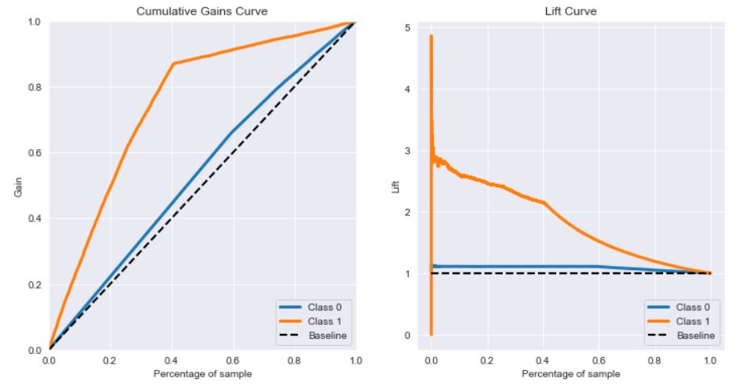

# health_insurance_cross_sell
This is a classification/ranking problem for my portfolio. The objective is to detect and sort health insurance customers that are more likely to buy a vehicle insurance, so the company can offer them this service and increase its income. To solve this problem we will build a machine learning model to rank the customers by the probability to accept and buy the vehicle insurance.

# 1.0 - Business Problem (Fictitious Scenario)

Despite of the successfully health insurance product, a given company wants to expand its business. Between a bunch of possibilities, the company choosed to expand by offering a new product to its clients: a car insurance. The company will use its database with information about all the current customers in order to offer them the new product. After defining the strategy, the company realized that they couldn't reach their entire customer database (381 thousands customers), since they will use phone calls to offer the product. With scarce resources, the strategic members highlighted  some key aspects:

* We need to be precise when contacting a customer to offer the product, since we have limited resources;
* How can we detect the customers who will accept the new product?
* How can we prioritize the customers according to the probability of the product acceptance?
* Which method we are going to use to minimize our cost and maximize our profit?

This is when the data team comes into play! They will develop a model that will predict the probability that a  health insurance current customer will accept to buy a vehicle insurance. Doing so, they can make a list sorting the customers by this probability. This way, sales team can be more assertive and make more deals with a fewer number of calls. In my <a href="https://github.com/rodrigomm92/health_insurance_cross_sell/blob/main/health_insurance_cross_sell.ipynb">Jupyter Notebook</a> you can follow all steps of this quest.

To facilitate the work of the sales team, the data science team will integrate its model with <a href="https://docs.google.com/spreadsheets/d/1o_8dH9RknjXbj6Zb_vBtCOhz8aVQ9ZT7gJxz0jEe2j4/edit#gid=0">Google Sheets</a>. They will use JavaScript to make API requests to the deployed model, and show the results in a spreadsheet.

The data we are going to use is a public dataset that can be found in this <a href="https://www.kaggle.com/datasets/anmolkumar/health-insurance-cross-sell-prediction">Kaggle Dataset</a>.

|Attribute | Definition
------------ | -------------
|id | Unique ID for the customer|
|Gender | Gender of the customer |
|Age | Age of the customer |
|Driving_License | 0 : Customer does not have DL, 1 : Customer already has DL  |
|Region_Code | Unique code for the region of the customer |
|Previously_Insured | 1 : Customer already has Vehicle Insurance, 0 : Customer doesn't have Vehicle Insurance|
|Vehicle_Age | Age of the Vehicle|
|Vehicle_Damage | 1 : Customer got his/her vehicle damaged in the past. 0 : Customer didn't get his/her vehicle damaged in the past.|
|Annual_Premium | The amount customer needs to pay as premium in the year |
|Policy Sales Channel | Anonymized Code for the channel of outreaching to the customer ie. Different Agents, Over Mail, Over Phone, In Person, etc. |
|Vintage | Number of Days, Customer has been associated with the company |
|Response | 1 : Customer is interested, 0 : Customer is not interested |

# 2.0 - Business Assumptions

We need to stablish some premises before we move on into the solution:

- The company will contact their customers by phone calls;
- The company has limited resources and limited phone calls to contact their customers;
- Before the project, the company strategy was to randomly choose customers to make the phone call.

# 3.0 - Solution Strategy

The development of the solution followed the CRISP-DM/DS methodology:

1. **Business problem:** Build a sorted list with the customers with higher probability to buy the vehicle insurance.

2. **Business understanding:** How a insurance product works, find clues that will lead customers to buy the new insurance. How age, vintage and vehicles information are related to the probability to accept the new product.

3. **Data extraction:** Collect data from Kaggle, using SQL, and import it using a jupyter notebook.

4. **Data cleaning:** Use python and its libraries to check for outliers, NA detection/treatment, feature engineering;

5. **Exploratory data analysis:** Use the cleaned dataset to draw charts with matplotlib and seaborn in order to discover insights, answer questions, evaluate hypothesis, uncover hidden information from the data. You can see the analysis in my <a href="https://github.com/rodrigomm92/health_insurance_cross_sell/blob/main/health_insurance_cross_sell.ipynb">Jupyter Notebook</a>.

6. **Modeling:** Use the knowledge acquired in EDA to select the features to our model. In this cycle we are also using the Extra Tree Classifier to doublecheck the chosen features. We also prepare these features using normalization, rescaling and transformation.

7. **ML Algorithms:** We will build different classification/ranking models based on our dataset. To make sure our solution is robust, not overfitting and generalizable to not seen data, we are going to use the cross-validation method. Models to be built: KNN, Logistic Regression, XGBoost and Random Forest.

8. **Evaluation:** Compare the models results regarding the performance metrics (Precision, Recall, Cumulative Gains Curve, Lift Curve), translate these results in a business language so the other teams can better understand and form their opinion. If the overall result is good enough we proceed to the deployment phase. If the teams decides to change any aspect of the project, another cycle of CRISP-DM/DS will take place.

9. **Deployment:** Use Heroku platform to deploy our model, which will respond to requests via API. We are also going to interface our solution with <a href="https://docs.google.com/spreadsheets/d/1o_8dH9RknjXbj6Zb_vBtCOhz8aVQ9ZT7gJxz0jEe2j4/edit#gid=0">Google Sheets</a>, so the sales team can use it with ease.

# 4.0 - Top Data Insights

- 61% of interested customers are men while 39% are women
- People aging 40-50 are the more interested in the insurance
- Almost 100% of interested customers are not previously insured.
- The interested customers are equally distributed by different vintage values

# 5.0 - Machine Learning Models

To solve this task, we will build models to gather the probability that a given customer will acquire the vehicle insurance. To do so, we will use classification algorithms, but instead of getting the class we are going to gather the probability. In every built model, we will consider the baseline performance as a random choice between the whole list of clients.

## 5.1 - Models Performance

- Precision: Percentage of clients that our model defined as high probability and they are actually interested in the insurance.
- Recall: From the total interested clients, the percentage caught by our model.

**Performance with Cross Validation (Calling 20% of the entire customer list)**

| Model Name | Precision    | Recall      |
|-----------|---------|-----------|
|  KNN  | 0.37 +/- 0.01045	| 0.604 +/- 0.01756	|
|  XGBoost	  | 0.334 +/- 0.00695 |	0.545 +/- 0.00555 |
|  Random Forest | 0.326 +/- 0.00326 |	0.533 +/- 0.0052 |
|  Logistic Regression	  | 0.29 +/- 0.00395 |	0.474 +/- 0.00574 |

**Final Model (After Hyperparameter Tuning)**

| Model Name | Precision | Recall |
|-----------|---------|-----------|
|  KNN  | 0.384	 | 0.622   |

<spacer type="horizontal" width="100" height="100">  </spacer>

From the achieved results, we see that with our model, calling only 40% of the entire customer list we will reach approximately 90% of the interested clients (Cumulative Gains Curve). In the meantime to achieve this 90% of interested clients the baseline model (random choice) will have to call approximately 90% of the entire customer list.

We also check, from the Lift Curve, that our model is at least 2x better than the baseline model, when we call at maximum 40% of the entire customer list.

Since the KNN is a light model and presented really good results as spoken before, KNN was our chosen model. We could also have chosen other models, but it depends on the other teams need and strategy.

# 6.0 - Overall Business Results

To achieve a better communication among the teams, it is a good practice to translate all technical vocabulary into a better understanding one. In this case, we translated the metrics from the models to financial values. The business and financial teams appreciate it!

To build our business performance analysis, we will use the average cost per call\* of $2.20 and the average cost of a vehicle insurance** of $1,652 per year.

| Scenario | Without the Model    | With the Model | Difference
|-----------|---------|---------|---------|
|  Cost to Reach 87% of Interested Customers  | US$ 729,234.00	|US$ 335,280.00 | US$ 394,000.00
|  Profit Making only 20,000 calls |US$ 4,049,052.00 |US$ 11.431.840 | US$ 7,382,788.00

In the first scenario, with our model, the company will reduce the number of calls in 54%, reaching the same amount of interested clients.

In a more restrict scenario, with only 20,000 calls, our model will increase the profit by US$ 7,382,788.00, by reaching 4,469 more clients then a random method.

\* <a href="https://www.fcbco.com/articles-and-whitepapers/articles/bid/129578/managing-your-cost-per-call#:~:text=The%20direct%20labor%20cost%20ranges,%242.70%20to%20%245.60%20per%20call.">F. Curtis Barry & Company</a>

** <a href="https://www.policygenius.com/auto-insurance/learn/how-much-is-car-insurance/">Policy Genius</a>

# 7.0 - Conclusions

From a business perspective we can testify the benefits of a machine learning model. Regardless the scenario, using the model we built, will bring to the company substantial benefits. From a more technical perspective, other models presented a better Cumulative Gains Curve, even though lower precision and recall. The choice of a model will depend on the company needs and its limited resources.

# 8.0 - Next steps

- Try another combination of features to build the model
- Try other standardization / normalization of data to build the model
- In a business sphere, try to gather more information to our dataset, in order to improve its performance
- Improve the Google Sheets interface with other functionalities, to enhance the user experience

# 9.0 - Used Tools

